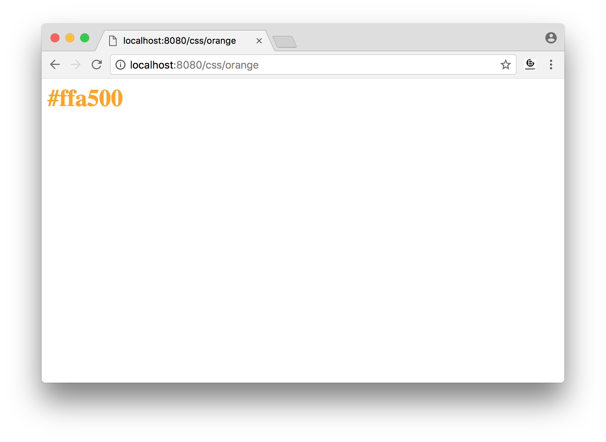
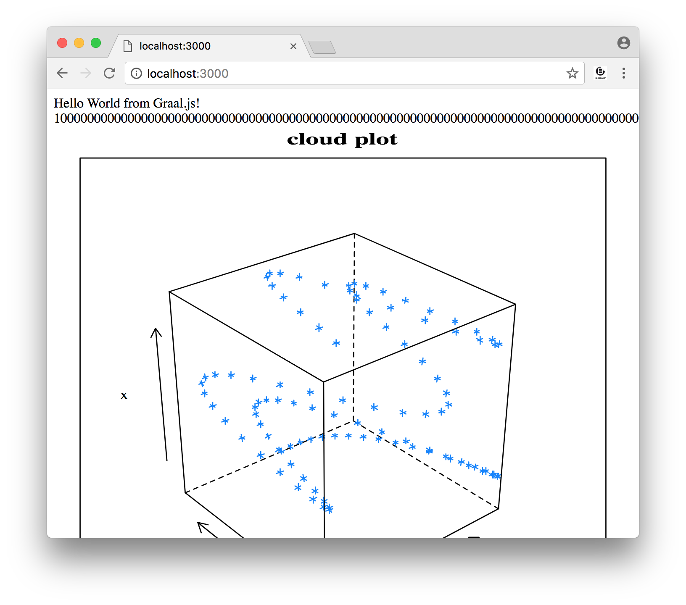
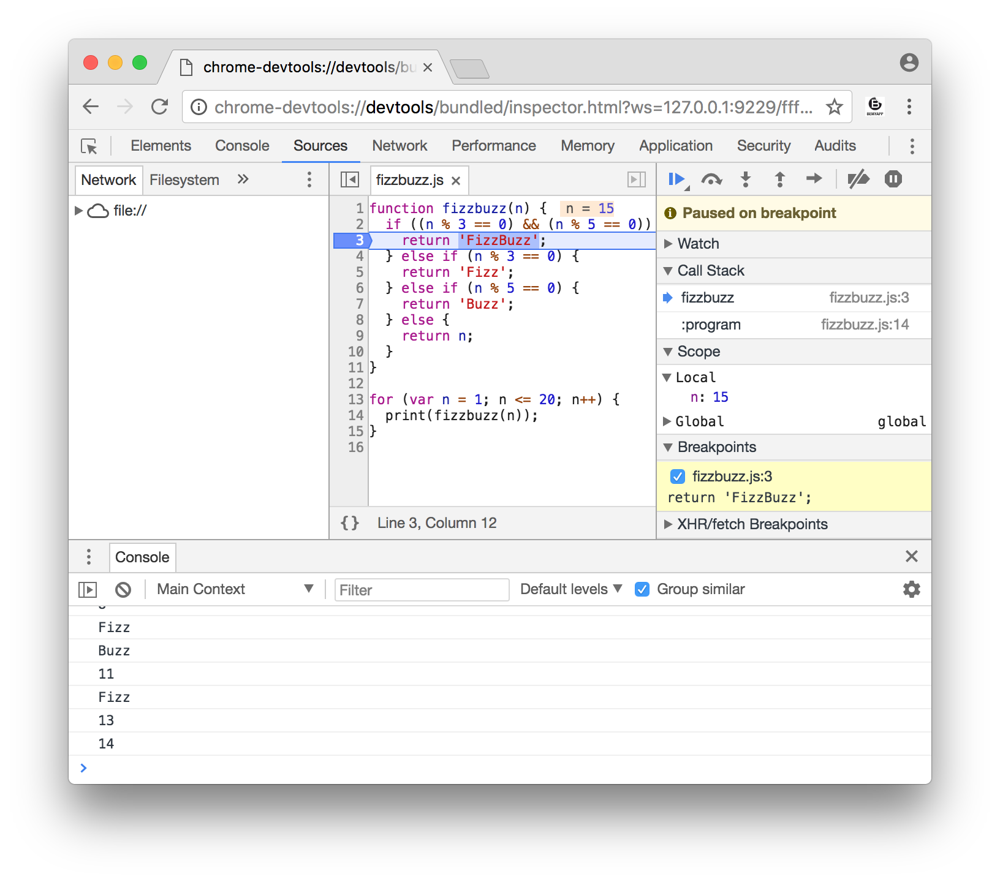
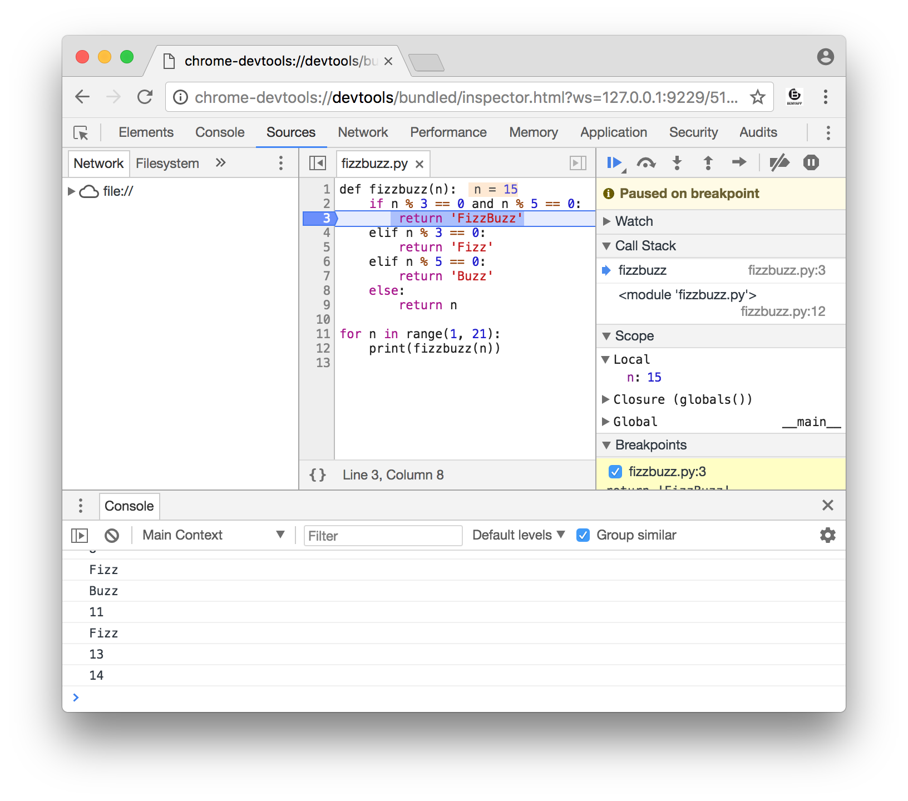
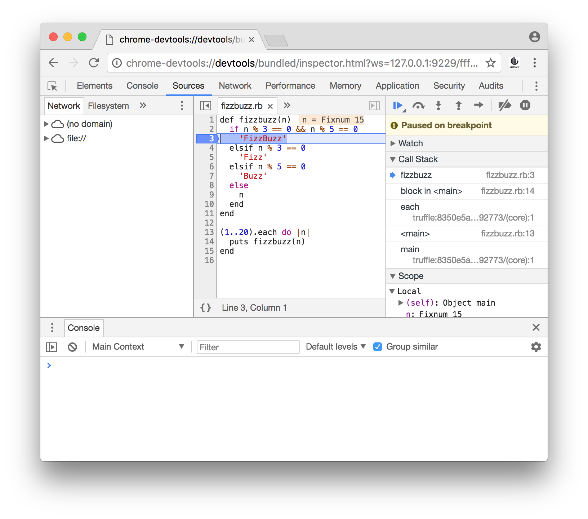
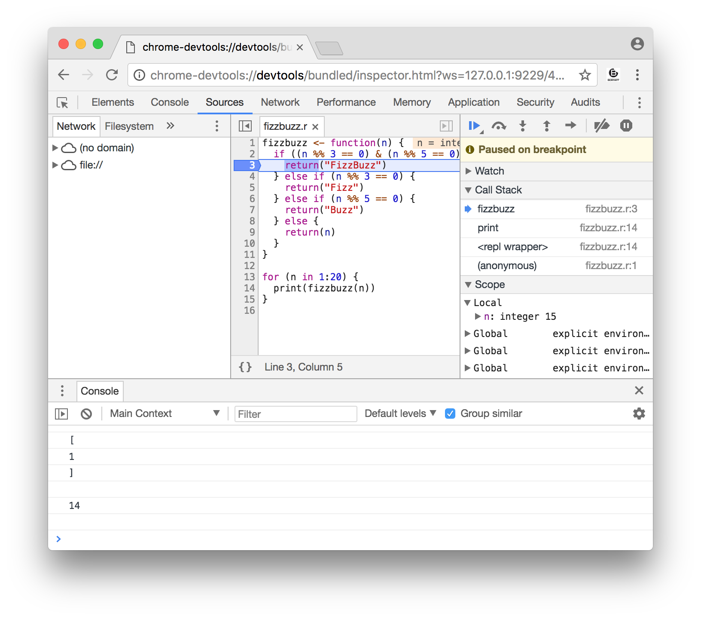
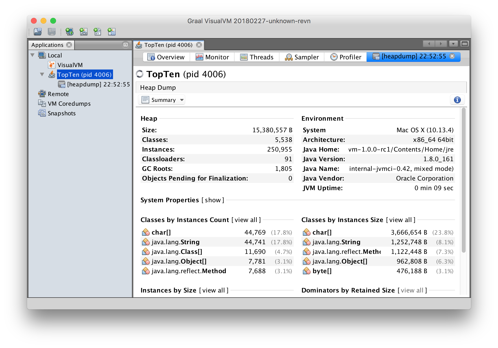
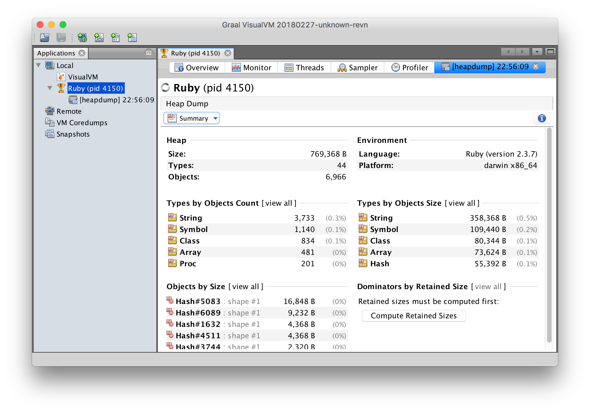

# Top 10 Things To Do With GraalVM

There are a lot of different parts to [GraalVM](https://www.graalvm.org/), so if
you've heard the name before, or even seen some of our talks, there are for sure
things that it can do that you don't know about yet. In this article we'll list
some of the diverse features of GraalVM and show you what they can do for you.

You can reproduce everything that I'm showing in this article with GraalVM 1.0.0
RC 1, which is available today from https://www.graalvm.org/downloads. I'm using
the Enterprise Edition on macOS, but the instructions will also work on Linux as
well as with the Community Edition.

Follow along and run these programs while you're reading! The code I'm running
on Graal can be cloned from http://github.com/chrisseaton/graalvm-ten-things/.

# Setup

I've downloaded the Enterprise Edition of GraalVM GraalVM 1.0.0 RC 1 from
https://www.graalvm.org/downloads, and put the programs from it onto my `$PATH`.
This gives me the Java and JavaScript languages by default.

```
$ git clone https://github.com/chrisseaton/graalvm-ten-things.git
$ cd foo
$ tar -zxf graalvm-ee-1.0.0-rc1-macos-amd64.tar.gz
    # or graalvm-ee-1.0.0-rc1-linux-amd64.tar.gz on Linux
$ export PATH=graalvm-1.0.0-rc1/Contents/Home/bin:$PATH
    # or PATH=graalvm-1.0.0-rc1/bin:$PATH on Linux
```

GraalVM comes with JavaScript included and has a package manager called
`gu` that lets you install additional languages. I've installed the Ruby, Python
and R languages, which get downloaded from GitHub.

```
$ gu install -c org.graalvm.ruby
$ gu install -c org.graalvm.python
$ gu install -c org.graalvm.R
```

Now when you run `java` or `js` you'll get the GraalVM versions of those
runtimes.

```
$ java -version
java version "1.8.0_161"
Java(TM) SE Runtime Environment (build 1.8.0_161-b12)
GraalVM 1.0.0-rc1 (build 25.71-b01-internal-jvmci-0.42, mixed mode)

$ js --version
Graal JavaScript 1.0 (GraalVM 1.0.0-rc1)
```

# 1. High-performance modern Java

The *Graal* name in the GraalVM comes from the Graal compiler. Graal is [one
compiler to rule them
all](http://lafo.ssw.uni-linz.ac.at/papers/2013_Onward_OneVMToRuleThemAll.pdf),
meaning that it's a single implementation of a compiler written as a library
which can be used for many different things. For example we use Graal to compile
both *ahead-of-time* and *just-in-time*, to compile multiple programming
languages, and to multiple architectures.

One simple way to use Graal is to use it as your Java JIT compiler.

We'll use this example program, which gives you the top-ten words in a document.
It uses modern Java language features like streams and collectors.

```java
import java.io.IOException;
import java.nio.file.Files;
import java.nio.file.Paths;
import java.util.Arrays;
import java.util.function.Function;
import java.util.stream.Collectors;
import java.util.stream.Stream;

public class TopTen {

    public static void main(String[] args) {
        Arrays.stream(args)
                .flatMap(TopTen::fileLines)
                .flatMap(line -> Arrays.stream(line.split("\\b")))
                .map(word -> word.replaceAll("[^a-zA-Z]", ""))
                .filter(word -> word.length() > 0)
                .map(word -> word.toLowerCase())
                .collect(Collectors.groupingBy(Function.identity(), Collectors.counting()))
                .entrySet().stream()
                .sorted((a, b) -> -a.getValue().compareTo(b.getValue()))
                .limit(10)
                .forEach(e -> System.out.format("%s = %d%n", e.getKey(), e.getValue()));
    }

    private static Stream<String> fileLines(String path) {
        try {
            return Files.lines(Paths.get(path));
        } catch (IOException e) {
            throw new RuntimeException(e);
        }
    }

}
```

GraalVM includes a `javac` compiler, but it isn't any different from the
standard one for the purposes of this demo, so you could use your system `javac`
instead if you wanted to.

```
$ javac TopTen.java
```

If we run the `java` command included in GraalVM we'll be automatically using
the Graal JIT compiler - no extra configuration is needed. I'll use the `time`
command to get the real, wall-clock elapsed time it takes to run the entire
program from start to finish, rather than setting up a complicated
micro-benchmark, and I'll use a large input so that we aren't quibbling about a
few seconds here or there. The `large.txt` file is 150 MB.

```
$ make large.txt
$ time java TopTen large.txt
sed = 502701
ut = 392657
in = 377651
et = 352641
id = 317627
eu = 317627
eget = 302621
vel = 300120
a = 287615
sit = 282613

real	0m17.367s
user	0m32.355s
sys	0m1.456s
```

Graal is written in Java, rather than C++ like most other JIT compilers for
Java. We think this allows us to improve it more quickly than existing
compilers, with powerful new optimisations such as partial escape analysis that
aren't available in the standard JIT compilers for HotSpot. This can make your
Java programs run significantly faster.

To run without the Graal JIT compiler to compare, I can use the flag
`-XX:-UseJVMCICompiler`. JVMCI is the interface between Graal and the JVM. You
could also compare against your standard JVM as well.

```
$ time java -XX:-UseJVMCICompiler TopTen large.txt
sed = 502701
ut = 392657
in = 377651
et = 352641
id = 317627
eu = 317627
eget = 302621
vel = 300120
a = 287615
sit = 282613

real	0m23.511s
user	0m24.293s
sys	0m0.579s
```

This shows Graal running our Java program in around three-quarters of the time
it takes to run it with a standard HotSpot compiler. In an area where we are
used to treating single-digit percentage increases in performance as
significant, this is a big-deal.

Twitter are one company [using Graal in production
today](https://www.youtube.com/watch?v=OSyvidFXL7M), and they say that for them
it is paying off in terms of real money saved. Twitter are using Graal to run
Scala applications - Graal works at the level of JVM bytecode so it works for
any JVM language.

This is the first way you can use GraalVM - simply as a drop-in better JIT
compiler for your existing Java applications.

# 2. Low-footprint, fast-startup Java

The Java platform is particularly strong for long-running processes and peak
performance, but short-running processes can suffer from longer startup time and
relatively high memory usage.

For example, if we run the same application with a much smaller input - around 1
KB instead of 150 MB, then it seems to take an unreasonably long time, and quite
a lot of memory at 60 MB, to run for such a small file. We use `-l` to print the
memory used as well as time used.

```
$ make small.txt
$ /usr/bin/time -l java TopTen small.txt   # -v on Linux instead of -l
sed = 6
sit = 6
amet = 6
mauris = 3
volutpat = 3
vitae = 3
dolor = 3
libero = 3
tempor = 2
suscipit = 2
        0.32 real         0.49 user         0.05 sys
  59846656  maximum resident set size
...
```

GraalVM gives us a tool that solves this problem. We said that Graal is like a
compiler library and it can be used in many different ways. One of those is to
compile *ahead-of-time*, to a native executable image, instead of compiling
*just-in-time* at runtime. This is similar to how a conventional compiler like
`gcc` works.

```
$ native-image --no-server TopTen
   classlist:   1,513.82 ms
       (cap):   2,333.95 ms
       setup:   3,584.09 ms
  (typeflow):   4,642.13 ms
   (objects):   3,073.58 ms
  (features):     156.34 ms
    analysis:   8,059.94 ms
    universe:     353.02 ms
     (parse):   1,277.02 ms
    (inline):   1,412.08 ms
   (compile):  10,337.76 ms
     compile:  13,776.23 ms
       image:   2,526.63 ms
       write:   1,525.03 ms
     [total]:  31,439.47 ms
```

This command produces a native executable called `topten`. This executable isn't
a launcher for the JVM, it doesn't link to the JVM, and it doesn't bundle the
JVM in any way. `native-image` really does compile your Java code, and any Java
libraries you use, all the way down to simple machine code. For runtime
components like the garbage collector we are running our own new VM called the
SubstrateVM, which like Graal is also written in Java.

If we look at the libraries which `topten` uses you can see they are only
standard system libraries. We could also move just this one file to a system
which has never had a JVM installed and run it there to verify it doesn't use a
JVM or any other files. It's also pretty small - this executable is less than 6
MB.

```
$ otool -L topten    # ldd topten on Linux
topten:
	/System/Library/Frameworks/CoreFoundation.framework/Versions/A/CoreFoundation (compatibility version 150.0.0, current version 1452.23.0)
	/usr/lib/libz.1.dylib (compatibility version 1.0.0, current version 1.2.11)
	/usr/lib/libSystem.B.dylib (compatibility version 1.0.0, current version 1252.50.4)
$ du -h topten 
5.7M	topten
```

If we run the executable we can see that it starts around an order of magnitude
faster, and uses around an order of magnitude less memory, than running the same
program on the JVM does. It's so fast that you don't notice the time taken when
using it at the command line - you don't feel that pause you always get when
running a short-running command with the JVM.

```
$ /usr/bin/time -l ./topten small.txt
sed = 6
sit = 6
amet = 6
mauris = 3
volutpat = 3
vitae = 3
dolor = 3
libero = 3
tempor = 2
suscipit = 2
        0.02 real         0.00 user         0.00 sys
   4702208  maximum resident set size
...
```

The `native-image` tool has some
[restrictions](https://github.com/oracle/graal/blob/master/substratevm/LIMITATIONS.md)
such as all classes having to be available during compilation, and some
limitations around reflection. It has some additional advantages over basic
compilation as well in that static initializers are run during compilation, so
you can reduce the work done each time an application loads.

This is a second way that you can use GraalVM - a way to distribute and run
your existing Java programs with a low-footprint and fast-startup. It also frees
you from configuration issues such as finding the right jar files at runtime,
and allows you to have smaller Docker images.

# 3. Combine JavaScript, Java, Ruby, and R

As well as Java, GraalVM includes new implementations of JavaScript, Ruby, R and
Python. These are written using a new language implementation framework called
*Truffle* that makes it possible to implement language interpreters that are
both simple and high performance. When you write a language interpreter using
Truffle, Truffle will automatically use Graal on your behalf to give you a JIT
compiler for your language. So Graal is not only a JIT compiler and
ahead-of-time native compiler for Java, it can also be a JIT compiler for
JavaScript, Ruby, R and Python.

The languages in GraalVM aim to be drop-in replacements for your existing
languages. For example we can install a Node.js module:

```
$ npm install --global color
...
+ color@3.0.0
added 6 packages in 14.156s
```

We can write a little program using this module to convert an RGB HTML color to
HSL:

```javascript
var Color = require('color');

process.argv.slice(2).forEach(function (val) {
  print(Color(val).hsl().string());
});
```

Then we can run that in the usual way:

```
$ node color.js '#42aaf4'
hsl(204.89999999999998, 89%, 60.8%)
```

The languages in GraalVM work together - there's an API which lets you run code
from one language in another. This lets you write polyglot programs - programs
written in more than one language.

You might want to do this because you want to write the majority of your
application in one language, but there's a library in another language's
ecosystem that you'd like to use. For example, say we'd like to write our
application for converting a CSS color name to hexadecimal in Node.js, but we
want to use a Ruby color library instead to do the conversion.

```javascript
var express = require('express');
var app = express();

color_rgb = Polyglot.eval('ruby', `
  require 'color'
  Color::RGB
`);

app.get('/css/:name', function (req, res) {
  color = color_rgb.by_name(req.params.name).html()
  res.send('<h1 style="color: ' + color + '" >' + color + '</h1>');
});

app.listen(8080, function () {
  console.log('serving at http://localhost:8080')
});
```

We specify some Ruby code to run as a string, but notice that we don't do much
in it - we just require the libraries, and then return a Ruby object. The way to
use this object from Ruby is normally to say `Color::RGB.by_name(name).html`. If
you look at how `color_rgb` is used further down by JavaScript, you can see that
actually we're calling these methods from JavaScript, even though they are Ruby
objects and methods, and we pass them a JavaScript string, and we concatenate
the result, which is a Ruby string, with other JavaScript strings.

We'll install both our Ruby and JavaScript dependencies.

```
$ gem install color
Fetching: color-1.8.gem (100%)
Successfully installed color-1.8
1 gem installed

$ npm install express
+ express@4.16.2
updated 1 package in 10.393s
```

We then need to run `node` with a couple of options: `--polyglot` to say we want
access to other languages, and `--jvm` because the `node` native image by
default doesn't include more than JavaScript.

```
$ node --polyglot --jvm color-server.js
serving at http://localhost:8080
```

Then open http://localhost:8080/css/aquamarine, or some other colour name, as
normal in your browser.



Let's try a larger example using more languages and modules.

JavaScript doesn't have a great solution for arbitrarily-large integers. I found
several modules like `big-integer` but these are all inefficient as they store
components of the number as JavaScript floating point numbers. Java's
`BigInteger` class is more efficient so let's use that instead to do some
arbitrarily-large integer arithmetic.

JavaScript also doesn't include any built-in support for drawing graphs, where R
does include excellent support for this. Let's use R's `svg` module to draw a
3D scatter plot of a trigonometric function.

In both cases we can use GraalVM's polyglot API, and we can just compose the
results from these other languages into JavaScript.

```js
const express = require('express')
const app = express()

const BigInteger = Java.type('java.math.BigInteger')

app.get('/', function (req, res) {
  var text = 'Hello World from Graal.js!<br> '

  // Using Java standard library classes
  text += BigInteger.valueOf(10).pow(100)
          .add(BigInteger.valueOf(43)).toString() + '<br>'

  // Using R interoperability to create graphs
  text += Polyglot.eval('R',
    `svg();
     require(lattice);
     x <- 1:100
     y <- sin(x/10)
     z <- cos(x^1.3/(runif(1)*5+10))
     print(cloud(x~y*z, main="cloud plot"))
     grDevices:::svg.off()
    `);

  res.send(text)
})

app.listen(3000, function () {
  console.log('Example app listening on port 3000!')
})
```

```
$ node --jvm --polyglot polyglot.js
```

Open http://localhost:3000/ in your browser to see the result.



That's the third thing we can do with GraalVM - run programs written in multiple
languages and use modules from those languages together. We think of this as a
kind of commoditisation of languages and modules - you can use whichever
language you think is best for your problem at hand, and whichever library you
want, no matter which language it came from.

# 4. Run native languages on the JVM

Another language that GraalVM supports is C. GraalVM can run C code in the same
way that it runs languages like JavaScript and Ruby.

What GraalVM actually supports is running the output of the LLVM toolchain -
LLVM bitcode - rather than directly supporting C. This means you can use your
existing tooling with C, and also other languages that can output LLVM, such as
C++, Fortran, and potentially other languages in the future. To make things
simple for a demo I'm running a special [single-file
version](http://people.csail.mit.edu/smcc/projects/single-file-programs/) of
gzip, maintained by [Stephen McCamant](http://people.csail.mit.edu/smcc/). It's
just the `gzip` source code and the `autoconf` configuration concatenated into
one file for simplicity. I've also had to patch a couple of things to make it
work on macOS and with clang, but not to get it working on GraalVM.

Then we can compile using standard `clang` (the LLVM C compiler), and we want it
to compile to LLVM bitcode, not native assembly, because that's what GraalVM can
run. I'm using `clang` 4.0.1.

```
$ clang -c -emit-llvm gzip.c
```

And then we run this directly using GraalVM using the `lli` command (LLVM
bitcode interpreter). Let's try compressing a file using my system `gzip`, and
then decompress using `gzip` running on GraalVM.

```
$ cat small.txt
Lorem ipsum dolor sit amet...
$ gzip small.txt
$ lli gzip.bc -d small.txt.gz
$ cat small.txt
Lorem ipsum dolor sit amet...
```

The implementations of Ruby and Python in GraalVM use this technique to run C
extensions for these languages. This means that you can run C extensions inside
the VM, and it allows us to maintain high performance even while supporting
these legacy native extension interfaces.

This is a fourth thing you can do with the GraalVM - run programs written in
native languages like C and C++, and also run C extensions to languages like
Python and Ruby, which existing JVM implementations like JRuby are not able to
do.

# 5. Tools that work across all languages

If you program in Java you're probably used to very high quality tools like
IDEs, debuggers and profilers. Not all languages have these kind of tools, but
you get them if you use a language in GraalVM.

All the GraalVM languages (except for Java at the moment) are implemented using
the common Truffle framework. This allows us to implement functionality like
debuggers once and have it available to all languages.

To try this we'll write a basic *FizzBuzz* program, because it prints things to
the screen and it has clear branches that are only taken on some iterations, so
we can set some breakpoints more easily. We'll start with a JavaScript
implementation.

```javascript
function fizzbuzz(n) {
  if ((n % 3 == 0) && (n % 5 == 0)) {
    return 'FizzBuzz';
  } else if (n % 3 == 0) {
    return 'Fizz';
  } else if (n % 5 == 0) {
    return 'Buzz';
  } else {
    return n;
  }
}

for (var n = 1; n <= 20; n++) {
  print(fizzbuzz(n));
}
```

We can run this JavaScript program as normal using GraalVM, using the `js`
executable.

```
$ js fizzbuzz.js
1
2
Fizz
4
Buzz
Fizz
...
```

We can also run the program with the flag `--inspect`. This will give us a link
to open in Chrome and will pause the program in the debugger.

```
$ js --inspect fizzbuzz.js
Debugger listening on port 9229.
To start debugging, open the following URL in Chrome:
    chrome-devtools://devtools/bundled/inspector.html?ws=127.0.0.1:9229/6c478d4e-1350b196b409
...
```

We can then set a breakpoint on the *FizzBuzz* line and then continue execution.
When it breaks we'll see the value of `n`, and can continue again, or explore
the rest of the debugging interface.



The Chrome debugger is usually used with JavaScript, but there's nothing special
about JavaScript in GraalVM. This flag is also available and working in our
implementations of Python, Ruby and R. I won't show you the source of each
program, but you run them in exactly the same way, and get the same Chrome
debugger interface to each.

```
$ graalpython --jvm --inspect fizzbuzz.py
```



```
$ ruby --inspect fizzbuzz.rb
```



```
$ Rscript --inspect fizzbuzz.r
```



Another tool that you may be familiar with using already from Java is VisualVM.
It gives you a user interface which you can connect to a running JVM on your
machine or somewhere over a network to inspect various aspects such as how it is
using memory and threads.

GraalVM includes VisualVM with the standard `jvisualvm` command.

```
$ jvisualvm &> /dev/null &
```

If we run it while we run our Java `TopTen` application from before, we can
watch the memory use over time, or we can do something like take a heap dump and
inspect what kind of objects we have using memory in our heap.

```
$ java TopTen large.txt
```



I've written this Ruby program to generate some garbage over time.

```ruby
require 'erb'

x = 42

template = ERB.new <<-EOF
  The value of x is: <%= x %>
EOF

loop do
  puts template.result(binding)
end
```

If you run a standard JVM language, like JRuby, with VisualVM you'll be
disappointed in that you'll see the underlying Java objects, rather than any
information about your language's objects.

If we use the GraalVM version of Ruby instead, VisualVM will recognise the Ruby
objects themselves. We need to use the `--jvm` command to use VisualVM, as it
doesn't support the native version of Ruby.

```
$ ruby --jvm render.rb
```

We can see the same heap view dump of underyling Java objects if we want to, or
under *Summary* we can select *Ruby Heap* and see proper Ruby objects instead.



The Truffle framework is a [kind of nexus for languages and
tools](http://programming-journal.org/2018/2/14/). If you program your languages
using Truffle, and you program your tools like this debugger against Truffle's
tool API, then each tool works with each language, and you only have to write
the tool once.

So the fifth way that you can use GraalVM is as a platform to get high quality
tooling for languages which don't always have the support behind them to build
bespoke tools like the Chrome Debugger or VisualVM.

# 6. Extend a JVM-based application

As well as being usable as standalone language implementations, and together in
a polyglot use case, these languages and tools can also be embedded in your Java
application. A new `org.graalvm.polyglot` API lets you load and run code in
other languages and to use values from them.

```java
import org.graalvm.polyglot.Context;
import org.graalvm.polyglot.Value;

public class ExtendJava {
    public static void main(String[] args) {
        String language = "js";
        try (Context context = Context.newBuilder().allowNativeAccess(true).build()) {
            for (String arg : args) {
                if (arg.startsWith("-")) {
                    language = arg.substring(1);
                } else {
                    Value v = context.eval(language, arg);
                    System.out.println(v);
                }
            }
        }
    }
}
```

If you use the `javac` and `java` commands from GraalVM, the imports
`org.graalvm...` will already be on your classpath, so you can compile and run
this without any extra flags.

```
$ javac ExtendJava.java
$ java ExtendJava '14 + 2'
16
$ java ExtendJava -js 'Math.sqrt(14)'
3.7416573867739413
$ java ExtendJava -python '[2**n for n in range(0, 8)]'
[1, 2, 4, 8, 16, 32, 64, 128]
$ java ExtendJava -ruby '[4, 2, 3].sort'
[2, 3, 4]
```

These versions of the languages are the same high-performance polyglot versions
that you get from using the commands like `node` and `ruby` as the GraalVM
executables.

This is a sixth way you can use GraalVM - as a single interface to embed many
different languages in your Java application. The polyglot API allows you to
take guest language objects and use them as Java interfaces and other
sophisticated interoperability.

# 7. Extend a native application

GraalVM already includes one native library built like this - it's a library
that lets you run code written in any GraalVM language from native applications.
JavaScript runtimes like V8, and Python interpreters like CPython, are often
embeddable meaning that they can be linked as a library into another
application. GraalVM lets you use any language in an embedded context, by
linking to this one polyglot embedding library.

The library is already built when you get GraalVM, but by default it only
includes the builtin language JavaScript. You can rebuild the polyglot library
to include other languages using the command below. This does take a few
minutes, so you may want to just experiment with JavaScript if you're following
along.

```
$ graalvm-1.0.0-rc1/Contents/Home/jre/lib/svm/bin/rebuild-images libpolyglot
```

We can write a simple C program that runs commands in any GraalVM language
passed on the command line. We're going to be doing the equivalent of our
`ExtendJava` example from above, but with C as the host language.

```c
#include <stdlib.h>
#include <stdio.h>

#include <polyglot_api.h>

int main(int argc, char **argv) {
  graal_isolate_t *isolate = NULL;
  graal_isolatethread_t *thread = NULL;
  
  if (graal_create_isolate(NULL, &isolate) != 0 || (thread = graal_current_thread(isolate)) == NULL) {
    fprintf(stderr, "initialization error\n");
    return 1;
  }
  
  poly_context context = NULL;
  
  if (poly_create_context(thread, NULL, 0, &context) != poly_ok) {
    fprintf(stderr, "initialization error\n");
    return 1;
  }
  
  char* language = "js";
  
  for (int n = 1; n < argc; n++) {
    if (argv[n][0] == '-') {
      language = &argv[n][1];
    } else {
      poly_value result = NULL;
      
      if (poly_context_eval(thread, context, language, "unicalc", argv[n], &result) != poly_ok) {
        fprintf(stderr, "eval error\n");
        return 1;
      }
      
      char buffer[1024];
      size_t length;
      
      if (poly_value_to_string_utf8(thread, result, buffer, sizeof(buffer), &length) != poly_ok) {
        fprintf(stderr, "to string error\n");
        return 1;
      }
      
      buffer[length] = '\0';
      printf("%s\n", buffer);
      
      poly_destroy_handle(thread, result);
    }
  }
  
  return 0;
}
```

We can then compile and run that using our system C compiler and link to the
native polyglot library in GraalVM. Again, it doesn't need a JVM.

```
$ clang -Igraalvm-1.0.0-rc1/Contents/Home/jre/lib/polyglot -rpath graalvm-1.0.0-rc1/Contents/Home -Lgraalvm-1.0.0-rc1/Contents/Home/jre/lib/polyglot -lpolyglot extendc.c -o extendc
$ otool -L extendc
extendc:
	@rpath/jre/lib/polyglot/libpolyglot.dylib (compatibility version 0.0.0, current version 0.0.0)
	/usr/lib/libSystem.B.dylib (compatibility version 1.0.0, current version 1252.50.4)
```

```
$ ./extendc '14 + 2'
16
$ ./extendc -js 'Math.sqrt(14)'
3.7416573867739413
$ ./extendc -python '[2**n for n in range(0, 8)]'
[1, 2, 4, 8, 16, 32, 64, 128]
```

This a seventh thing you can do with the GraalVM - use a single library in your
native application to embed any GraalVM language.

# 8. Java code as a native library

Java has a great ecosystem of many very high quality libraries, which often
aren't available in other ecosystems, including native applications as well as
other managed languages. If you wanted to use a Java library from a native
application you could embed the JVM but this gets very large and complicated
very quickly.

GraalVM lets you take Java library, either off-the-shelf or one you've written
yourself, and compile it to a standalone native library for use from other
native languages. As with our native compilation before, they don't require a
JVM to run.

I wrote an application that uses the excellent Apache SIS geospatial library to
calculate the great-circle distance between two points on Earth. I used SIS 0.8
which I downloaded separately from http://sis.apache.org/ and extracted the jar
from.

```java
import org.apache.sis.distance.DistanceUtils;

public class Distance {

    public static void main(String[] args) {
        final double aLat   = Double.parseDouble(args[0]);
        final double aLong  = Double.parseDouble(args[1]);
        final double bLat   = Double.parseDouble(args[2]);
        final double bLong  = Double.parseDouble(args[3]);
        System.out.printf("%f km%n", DistanceUtils.getHaversineDistance(aLat, aLong, bLat, bLong));
    }

}
```

We can compile this as normal, and then use it to work out the distance between
London (latitude 51.507222, longitude -0.1275) and New York (40.7127, -74.0059).

```
$ javac -cp sis.jar -parameters Distance.java
$ java -cp sis.jar:. Distance 51.507222 -0.1275 40.7127 -74.0059
5570.25 km
```

We can compile that to a native executable, as we did with our `topten` program.

```
$ native-image --no-server -cp sis.jar:. Distance
...
$ ./distance 51.507222 -0.1275 40.7127 -74.0059
5570.25 km
```

We can also build this as a native shared library, instead of an executable. To
do that we declare one or more methods as `@CEntryPoint`.

```java
...
import org.graalvm.nativeimage.IsolateThread;
import org.graalvm.nativeimage.c.function.CEntryPoint;

public class Distance {

    ...

    @CEntryPoint(name = "distance")
    public static double distance(IsolateThread thread,
          double a_lat, double a_long,
          double b_lat, double b_long) {
        return DistanceUtils.getHaversineDistance(a_lat, a_long, b_lat, b_long);
    }
    
    ...

}
```

We don't need to change our `javac` command line because GraalVM automatically
puts these new APIs onto the classpath. We can then compile to a shared
library, and an automatically generated header file.

```
$ native-image --no-server -cp sis.jar:. -H:Kind=SHARED_LIBRARY -H:Name=libdistance
$ otool -L libdistance.dylib   # .so on Linux
libdistance.dylib:
	.../libdistance.dylib (compatibility version 0.0.0, current version 0.0.0)
	/System/Library/Frameworks/CoreFoundation.framework/Versions/A/CoreFoundation (compatibility version 150.0.0, current version 1452.23.0)
	/usr/lib/libz.1.dylib (compatibility version 1.0.0, current version 1.2.11)
	/usr/lib/libSystem.B.dylib (compatibility version 1.0.0, current version 1252.50.4)
$ du -h libdistance.dylib
4.8M	libdistance.dylib
```

We can then write a little C program to use the library. The interface to our
native library does have a little ceremony - because the VM needs to manage a
heap, threads, a garbage collector and other services, we need to create an
instance of the system, and tell it about our main thread.

```c
#include <stdlib.h>
#include <stdio.h>

#include <libdistance.h>

int main(int argc, char **argv) {
  graal_isolate_t *isolate = NULL;
  graal_isolatethread_t *thread = NULL;
  
  if (graal_create_isolate(NULL, &isolate) != 0 || (thread = graal_current_thread(isolate)) == NULL) {
    fprintf(stderr, "initialization error\n");
    return 1;
  }
  
  double a_lat   = strtod(argv[1], NULL);
  double a_long  = strtod(argv[2], NULL);
  double b_lat   = strtod(argv[3], NULL);
  double b_long  = strtod(argv[4], NULL);
  
  printf("%f km\n", distance(thread, a_lat, a_long, b_lat, b_long));
  
  return 0;
}
```

We compile this with our standard system tools and can run our executable (set
`LD_LIBRARY_PATH=.` on Linux).

```
$ clang -I. -L. -ldistance distance.c -o distance
$ otool -L distance
distance:
	/Users/chrisseaton/Documents/graalvm-blog-post/libdistance.dylib (compatibility version 0.0.0, current version 0.0.0)
	/usr/lib/libSystem.B.dylib (compatibility version 1.0.0, current version 1252.0.0)
$ ./distance 51.507222 -0.1275 40.7127 -74.0059
5570.25 km
```

This is an eighth thing we can do with GraalVM - compile Java code to a native
library that we can then use in native applications without using a full JVM.

# 9. Polyglot in the database

One application of the polyglot library for embedding languages is in the Oracle
Database. We've used it to create the Oracle Database Multilingual Engine (MLE)
which includes support for using GraalVM languages and modules from SQL.

For example, say that we have a frontend already written in JavaScript, and
we're doing some validation of email addresses using the JavaScript module
`validator`. If we have some logic for the same application in the database
written in SQL or PLSQL we'd like to be able to use exactly the same validator
so that the results are the same.

You can download the MLE as Docker image from
https://oracle.github.io/oracle-db-mle/releases/0.2.7/docker/. Then load it into
Docker.

```
$ docker load --input mle-docker-0.2.7.tar.gz
```

We want to run the image, and then when it's finished loading, which can take a
few minutes, execute a Bash terminal in it.

```
$ docker run mle-docker-0.2.7
$ docker ps
$ docker exec -ti <container_id> bash -li
```

If we can run the interactive SQL tool, `sqlplus`, in this Bash terminal to
connect to the database then it's up and running.

```
$ sqlplus scott/tiger@localhost:1521/ORCLCDB
```

Now, still in the Bash terminal running in Docker, we install that `validator`
module and then we run a command `dbjs` to deploy it into the database. Then
we run `sqlplus` again.

```
$ npm install validator
$ npm install @types/validator
$ dbjs deploy -u scott -p tiger -c localhost:1521/ORCLCDB validator
$ sqlplus scott/tiger@localhost:1521/ORCLCDB
```

We can now use the `validator` module as part of an SQL expression.

```
SQL> select validator.isEmail('hello.world@oracle.com') from dual;

VALIDATOR.ISEMAIL('HELLO.WORLD@ORACLE.COM')
-------------------------------------------
                                          1

SQL> select validator.isEmail('hello.world') from dual;

VALIDATOR.ISEMAIL('HELLO.WORLD')
--------------------------------
                               0

```

This is our ninth thing that you can do with GraalVM - run GraalVM languages
inside the Oracle Database so that you can use the same logic from your
frontends or backends inside your Database logic, instead of always having to
pull it out of the database to an application server.

# 10. Create your own language

Oracle Labs and our academic collaborators have been able to make new
high-performance implementations of JavaScript, R, Ruby, Python and C with a
relatively small team because we have developed the Truffle framework to make
this easy.

Truffle is a Java library that helps you to write an *abstract syntax tree*
(AST) interpreter for a language. An AST interpreter is probably the simplest
way to implement a language, because it works directly on the output of the
parser and doesn't involve any bytecode or conventional compiler techniques, but
it is often slow. We have therefore combined it with a technique called *partial
evaluation*, which allows Truffle to use Graal to automatically provide a
just-in-time compiler for your language, just based on your AST interpreter.

You can use Truffle to implement your own new programming language, to create a
high-performance implementation of an existing programming language, or to
implement a domain specific language. We talk a lot about the details of Truffle
and Graal in our project, but we often forget to mention that Truffle is the
*easy* way to implement a language. And you get features like the debugger
automatically. Anyone who's done just an undergraduate course in programming
language implementation should have the basic skills needed. Oracle Labs
implemented a basic version of Ruby faster than any previous efforts with just
one intern over a few months.

We don't have space here to show a complete language, even a tiny one, but
[SimpleLanguage](https://github.com/graalvm/simplelanguage) is an executable
tutorial of how to create your own language using Truffle, based around a
simplified JavaScript-style language. For example [see the
implementation](https://github.com/graalvm/simplelanguage/blob/master/src/main/java/com/oracle/truffle/sl/nodes/controlflow/SLIfNode.java)
of the `if` statement.

Other languages written using Truffle by people outside of Oracle Labs includes
a [Smalltalk variant](https://github.com/SOM-st/TruffleSOM), a [Newspeak
variant](https://github.com/smarr/SOMns), and a [Lisp
variant](https://github.com/cesquivias/mumbler). The Lisp example has a
[tutorial](http://cesquivias.github.io) you can follow.

# Conclusion

GraalVM enables a very diverse set of new functionality - it's a platform on
which you can build more powerful languages and tools and put them into more
environments. It lets you pick the language and modules you want no matter where
the program is running or which languages you're using already.

To try GraalVM go to https://www.graalvm.org/. There are links to downloads and
documentation there, and more examples like we've shown in this blog post.

Try following along with the instructions here, and try adapting them to see
what else you can do. Let us know how you're experimenting with GraalVM in your
application and send us any feedback
[@ChrisGSeaton](https://twitter.com/ChrisGSeaton) or
[@shelajev](https://twitter.com/shelajev).
